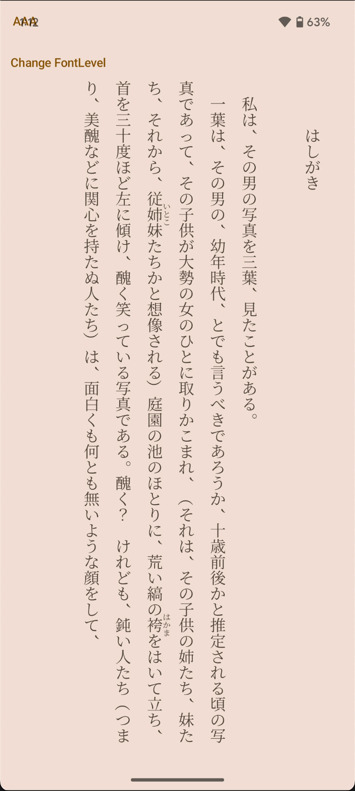

# AozoraBooks

**AozoraBooks** is a modern, cross-platform reading app built with **Kotlin Multiplatform**, designed for reading novels in the [Aozora Bunko (青空文庫)](https://www.aozora.gr.jp/) format. 
It supports advanced layout features like ruby annotations and vertical text, and runs on Android, iOS.

⚠️ This project is in a very early stage of development. 

## Download

## Features

- Support for Aozora Bunko HTML format, including:
  - Ruby text (`<ruby>`)
  - ..
- Cross-platform with shared codebase (Android / iOS)

## Screenshots

  

## Tech Stack

| Layer          | Tech                                 |
|----------------|--------------------------------------|
| Language       | Kotlin Multiplatform                 |
| UI             | Jetpack Compose Multiplatform        |
| Parsing        | Ksoup (for HTML), custom parser      |
| I/O            | Okio, kotlinx-io                     |
| State Mgmt     | Circuit (Composable UDF)             |
| Dependency Injection | Koin                           |
| Platforms      | Android, iOS                         |

## Getting Started

### Prerequisites
- Android Studio(Meerkat or newer)
- Install the [Kotlin Multiplatform Plugin](https://plugins.jetbrains.com/plugin/14936-kotlin-multiplatform) in Android Studio.
- Xcode(for iOS build)
- JDK(17)

### Run the App (Android)

1. Connect an Android device or start an emulator in Android Studio.  
2. Wait for the Gradle sync to complete successfully.  
3. Add a new **Android Run Configuration**, and select the `composeApp` module.  
   > Android Studio usually recognizes this module automatically. If not, configure it manually.  
4. Click the **Run** ▶️ button to launch the app.

### Run the app (iOS)

1. Wait for the Gradle sync to complete successfully.
2. Add a new **iOS Application Configuration** in Android Studio or IntelliJ IDEA.
   > Xcode project path: `<project root>/iosApp/iosApp.xcodeproj`  
   > Execution target: any simulator compatible with your installed Xcode version
3. Click the **Run** ▶️ button to launch the app.

### Code style

This project uses [ktlint](https://github.com/pinterest/ktlint).`

running `./gradlew ktLintFormat` to automatically fix lint errors.

running `./gradlew spotlessApply` to add copyright.

### Update License list in app

running `./gradlew :composeApp:licensee` to update license file.

### Run Tests before contributing

1. Run `./gradlew connectedDebugAndroidTest` to execute android instrument tests.
2. Run `./gradlew iosSimulatorArm64Test` to execute iOS tests.